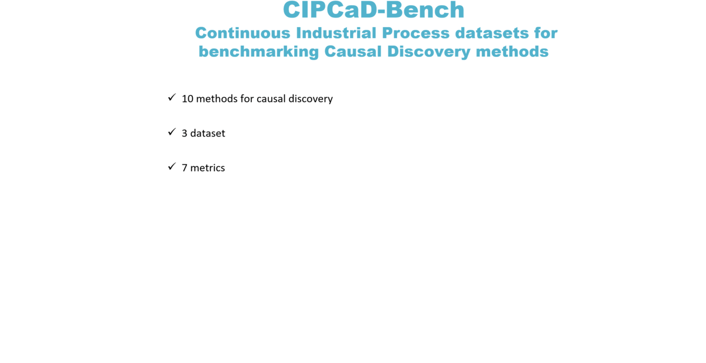

<div align="center">
<a href="https://metropolis.scienze.univr.it/">

</a>
</div>

**CIPCaD-Bench: Continuous Industrial Process datasets for benchmarking Causal Discovery methods**

Giovanni Menegozzo, Diego Dall'Alba, Paolo Fiorini,  2022

<p float="center">  </p>

[](https://ieeexplore.ieee.org/document/9926420)

This repository contains data extracted from **continuous manufacturing productions**. The datasets are used for causal discovery as well for predictive monitoring and fault detection. For any questions regarding the collection and use of the data do not hesitate to contact the authors. Do not forget to cite our work.


## Citation

```bibtex
@INPROCEEDINGS{9926420,

  author={Menegozzo, Giovanni and Dall’Alba, Diego and Fiorini, Paolo},

  booktitle={2022 IEEE 18th International Conference on Automation Science and Engineering (CASE)}, 

  title={CIPCaD-Bench: Continuous Industrial Process datasets for benchmarking Causal Discovery methods}, 

  year={2022},

  volume={},

  number={},

  pages={2124-2131},

  doi={10.1109/CASE49997.2022.9926420}}
```
